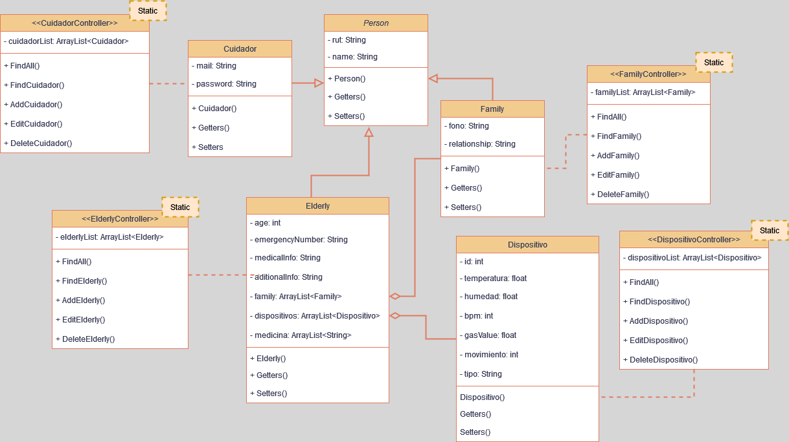

## Repositorio Principal del proyecto para IOT SafeEnvironment
### Descripcion del proyecto
Safe Environment es un sistema de monitoreo no invasivo diseñado para mejorar el cuidado de personas mayores. 
Utiliza una red de sensores para recopilar datos en tiempo real sobre el entorno y la salud del adulto mayor, proporcionando información crucial a los cuidadores a través de una aplicación móvil.

### Objetivos Principales
- Monitorear condiciones ambientales (temperatura, humedad, CO2)
- Detectar movimiento y caídas
- Monitorear el ritmo cardíaco
- Proporcionar alertas en tiempo real
- Ofrecer una interfaz móvil intuitiva para cuidadores

---

